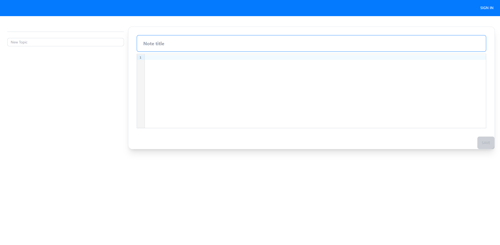

# 📒 Supa-Notes

A simple note taking application built using the [T3 tech stack](https://create.t3.gg/) with Supabase

## 👩‍💻 Contributors

- [@aviralj02](https://github.com/aviralj02)

## 📷 Preview



## 🔬 Local Setup

```
$ git clone https://github.com/SanyamPunia/t3-notetaker.git
$ cd t3-notetaker
$ npm install
$ npm run dev
```

Add your `GITHUB_CLIENT_ID` & `GITHUB_CLIENT_SECRET` locally and in production.

## Supabase Database
* Used for storing user-specific `Topics` & `Notes`
* [Prisma](https://www.prisma.io/) is used as an ORM
